# groq-chain

[](https://pypi.org/project/groq-chain/)
[](LICENSE)
[](https://github.com/iamadhitya1)


> Dead-simple Groq LLM chaining in Python. Chain prompts with `.step()` — no LangChain needed.

LangChain is overkill for most things. `groq-chain` gives you prompt chaining in plain Python — pass the output of one LLM call into the next, with zero magic.

<div align="center">
  
</div>

---

## When to use this

Use `groq-chain` when:
- You need to **chain 2–5 LLM calls** where each step feeds the next (summarize → rewrite → translate)
- You want **Groq's speed** without the LangChain abstraction overhead
- You're building **document pipelines, content transforms, or multi-step AI workflows** in pure Python
- You want something you can read and understand in 10 minutes

Not the right fit if you need agents, tool calling, vector stores, or retrieval — LangChain or LlamaIndex are built for that. `groq-chain` is intentionally a thin wrapper for linear prompt pipelines.

---

## Why not LangChain?

| | groq-chain | LangChain |
|---|---|---|
| Install size | 1 dependency (`groq`) | 50+ transitive dependencies |
| Lines to chain 3 prompts | ~5 | ~40 |
| Learning curve | Read the README once | Days |
| Best for | Linear pipelines | Agents, RAG, complex graphs |

If you're chaining prompts, not building an agent, `groq-chain` does it in a fraction of the code.

---

## Install

```bash
pip install groq-chain
```

> **Note:** the package is `groq-chain` but the import is `groqchain` (no hyphen):
> ```python
> from groqchain import GroqChain
> ```

Or from source:
```bash
git clone https://github.com/iamadhitya1/groq-chain
pip install -e groq-chain/
```

---

## Quick start

```python
from groqchain import GroqChain

chain = GroqChain(api_key="gsk_...")  # or set GROQ_API_KEY env var

# Single call
result = chain.run("Summarize this in 3 bullet points: {text}", text="...")
print(result)
```

---

## Chained calls

Pass the output of each step into the next automatically:

```python
result = (
    GroqChain(api_key="gsk_...")
    .step("Extract 3 key insights from: {text}", output_key="insights", text="...")
    .step("Write a LinkedIn post based on these insights: {insights}")
    .run()
)
print(result)
```

Each `.step()` receives the previous step's output via `output_key`.

---

## Get all step outputs

```python
results = (
    GroqChain(api_key="gsk_...")
    .step("Translate to French: {text}", output_key="french", text="Hello world")
    .step("Now translate the French to Spanish: {french}", output_key="spanish")
    .run_all()
)

print(results["french"])   # Bonjour le monde
print(results["spanish"])  # Hola mundo
```

---

## Inject context

```python
chain = (
    GroqChain(api_key="gsk_...")
    .context(language="Hindi", tone="casual")
    .step("Write a {tone} greeting in {language}")
)
result = chain.run()
```

---

## System prompt

```python
chain = GroqChain(
    api_key="gsk_...",
    system="You are a senior software engineer. Be concise and technical.",
)
result = chain.run("Review this code: {code}", code="...")
```

---

## All options

```python
GroqChain(
    api_key="gsk_...",                      # or GROQ_API_KEY env var
    model="llama-3.3-70b-versatile",        # any Groq model
    temperature=0.7,
    max_tokens=1024,
    system="Optional system prompt",
)
```

**Available Groq models:**
- `llama-3.3-70b-versatile` ← default
- `llama-3.1-8b-instant`
- `mixtral-8x7b-32768`
- `gemma2-9b-it`

---

## Real-world example — document pipeline

```python
import os
from groqchain import GroqChain

chain = GroqChain(api_key=os.environ["GROQ_API_KEY"])

with open("contract.txt") as f:
    doc = f.read()

results = (
    chain
    .step("Summarize this legal document: {doc}", output_key="summary", doc=doc)
    .step("List any risky clauses from this summary: {summary}", output_key="risks")
    .step("Rate the overall risk from 1-10 and explain why: {risks}", output_key="rating")
    .run_all()
)

print("Summary:", results["summary"])
print("Risks:",   results["risks"])
print("Rating:",  results["rating"])
```

---

## Author

**[M. Adhitya](https://iamadhitya.vercel.app)** — Builder, [Rewrite Labs](https://rewritelabs.vercel.app) · [Newsletter](https://adhitya.beehiiv.com/)

## License

MIT © 2025 [M. Adhitya](https://iamadhitya.vercel.app)

Built at [Rewrite Labs](https://rewritelabs.vercel.app)
